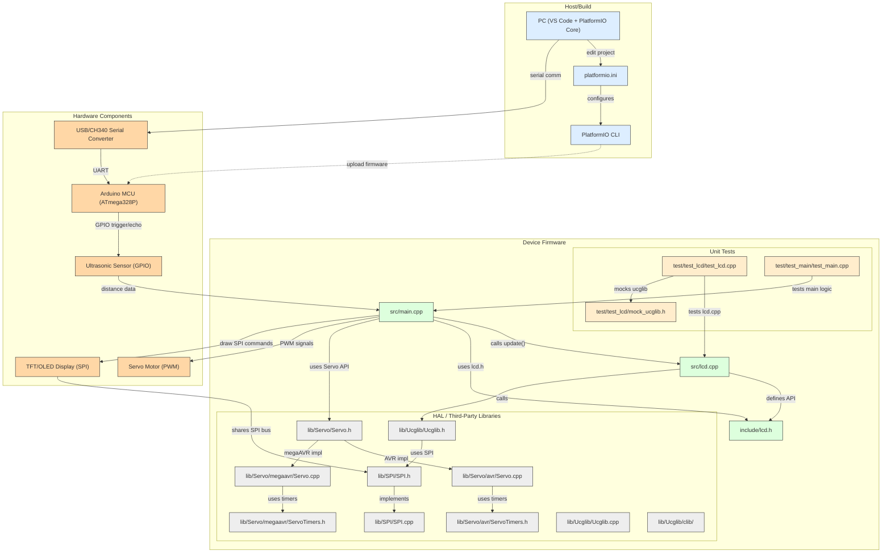

# Diagram

```mermaid
flowchart TB
    %% Host/Build Layer
    subgraph "Host/Build"
        PC["PC (VS Code + PlatformIO Core)"]:::host
        PlatformIO["PlatformIO CLI"]:::host
        PIOIni["platformio.ini"]:::host
    end

    %% Device/Firmware Layer
    subgraph "Device Firmware"
        direction TB
        Core["src/main.cpp"]:::firmware
        LCDCPP["src/lcd.cpp"]:::firmware
        LCDH["include/lcd.h"]:::firmware
        subgraph "HAL / Third-Party Libraries"
            direction TB
            SPIH["lib/SPI/SPI.h"]:::thirdparty
            SPICPP["lib/SPI/SPI.cpp"]:::thirdparty
            ServoPub["lib/Servo/Servo.h"]:::thirdparty
            ServoAvrCPP["lib/Servo/avr/Servo.cpp"]:::thirdparty
            ServoAvrTimers["lib/Servo/avr/ServoTimers.h"]:::thirdparty
            ServoMegaCPP["lib/Servo/megaavr/Servo.cpp"]:::thirdparty
            ServoMegaTimers["lib/Servo/megaavr/ServoTimers.h"]:::thirdparty
            UcglibH["lib/Ucglib/Ucglib.h"]:::thirdparty
            UcglibCPP["lib/Ucglib/Ucglib.cpp"]:::thirdparty
            Clib["lib/Ucglib/clib/"]:::thirdparty
        end
        subgraph "Unit Tests"
            direction TB
            TestLCD["test/test_lcd/test_lcd.cpp"]:::test
            MockUcglib["test/test_lcd/mock_ucglib.h"]:::test
            TestMain["test/test_main/test_main.cpp"]:::test
        end
    end

    %% Hardware Layer
    subgraph "Hardware Components"
        direction TB
        MCU["Arduino MCU (ATmega328P)"]:::hardware
        Serial["USB/CH340 Serial Converter"]:::hardware
        Sensor["Ultrasonic Sensor (GPIO)"]:::hardware
        ServoHW["Servo Motor (PWM)"]:::hardware
        Display["TFT/OLED Display (SPI)"]:::hardware
    end

    %% Build/Upload Flow (dashed)
    PC -->|"edit project"| PIOIni
    PIOIni -->|"configures"| PlatformIO
    PlatformIO -.->|"upload firmware"| MCU

    %% Runtime Flows
    MCU -->|"GPIO trigger/echo"| Sensor
    Sensor -->|"distance data"| Core
    Core -->|"calls update()"| LCDCPP
    LCDCPP -->|"defines API"| LCDH
    Core -->|"uses lcd.h"| LCDH
    LCDCPP -->|"calls"| UcglibH
    UcglibH -->|"uses SPI"| SPIH
    SPIH -->|"implements"| SPICPP
    Core -->|"uses Servo API"| ServoPub
    ServoPub -->|"AVR impl"| ServoAvrCPP
    ServoAvrCPP -->|"uses timers"| ServoAvrTimers
    ServoPub -->|"megaAVR impl"| ServoMegaCPP
    ServoMegaCPP -->|"uses timers"| ServoMegaTimers
    Core -->|"PWM signals"| ServoHW
    Core -->|"draw SPI commands"| Display
    Display -->|"shares SPI bus"| SPIH
    PC -->|"serial comm"| Serial
    Serial -->|"UART"| MCU

    %% Unit Test Flows
    TestLCD -->|"tests lcd.cpp"| LCDCPP
    TestLCD -->|"mocks ucglib"| MockUcglib
    TestMain -->|"tests main logic"| Core

    %% Click Events
    click PIOIni "https://github.com/rodrigoacc10/ultrasonic_radar/blob/main/platformio.ini"
    click Core "https://github.com/rodrigoacc10/ultrasonic_radar/blob/main/src/main.cpp"
    click LCDCPP "https://github.com/rodrigoacc10/ultrasonic_radar/blob/main/src/lcd.cpp"
    click LCDH "https://github.com/rodrigoacc10/ultrasonic_radar/blob/main/include/lcd.h"
    click SPIH "https://github.com/rodrigoacc10/ultrasonic_radar/blob/main/lib/SPI/SPI.h"
    click SPICPP "https://github.com/rodrigoacc10/ultrasonic_radar/blob/main/lib/SPI/SPI.cpp"
    click ServoPub "https://github.com/rodrigoacc10/ultrasonic_radar/blob/main/lib/Servo/Servo.h"
    click ServoAvrCPP "https://github.com/rodrigoacc10/ultrasonic_radar/blob/main/lib/Servo/avr/Servo.cpp"
    click ServoAvrTimers "https://github.com/rodrigoacc10/ultrasonic_radar/blob/main/lib/Servo/avr/ServoTimers.h"
    click ServoMegaCPP "https://github.com/rodrigoacc10/ultrasonic_radar/blob/main/lib/Servo/megaavr/Servo.cpp"
    click ServoMegaTimers "https://github.com/rodrigoacc10/ultrasonic_radar/blob/main/lib/Servo/megaavr/ServoTimers.h"
    click UcglibH "https://github.com/rodrigoacc10/ultrasonic_radar/blob/main/lib/Ucglib/Ucglib.h"
    click UcglibCPP "https://github.com/rodrigoacc10/ultrasonic_radar/blob/main/lib/Ucglib/Ucglib.cpp"
    click Clib "https://github.com/rodrigoacc10/ultrasonic_radar/tree/main/lib/Ucglib/clib/"
    click TestLCD "https://github.com/rodrigoacc10/ultrasonic_radar/blob/main/test/test_lcd/test_lcd.cpp"
    click MockUcglib "https://github.com/rodrigoacc10/ultrasonic_radar/blob/main/test/test_lcd/mock_ucglib.h"
    click TestMain "https://github.com/rodrigoacc10/ultrasonic_radar/blob/main/test/test_main/test_main.cpp"

    %% Styles
    classDef host fill:#ddeeff,stroke:#333,stroke-width:1px;
    classDef firmware fill:#ddffdd,stroke:#333,stroke-width:1px;
    classDef thirdparty fill:#eeeeee,stroke:#333,stroke-width:1px;
    classDef hardware fill:#ffd7a6,stroke:#333,stroke-width:1px;
    classDef test fill:#ffedcc,stroke:#333,stroke-width:1px;
```

Created using: [https://gitdiagram.com/](https://gitdiagram.com/)
