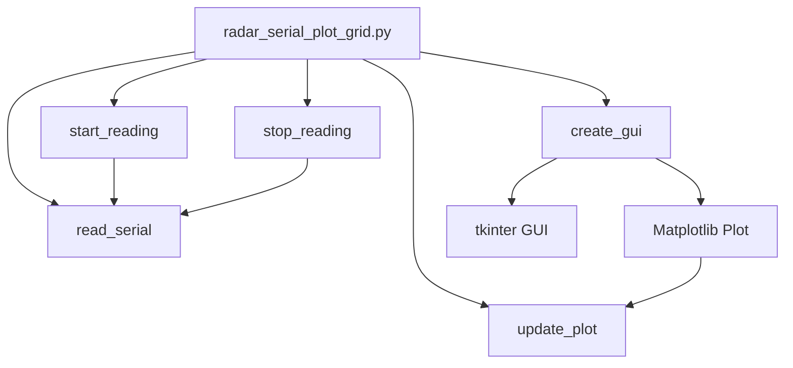

# Ultrasonic Radar Serial Plotter – Detailed Design Document

## Overview

This application provides a graphical interface for visualizing ultrasonic radar data received via a serial port. The data is plotted as a scatter plot with fixed axes, showing the relationship between angle (degrees) and distance (cm). The serial port and baudrate are hardcoded for ease of use.

---

## Features

- **Automatic Serial Connection:**  
  Connects to `COM4` at `115200` baudrate without user input.
- **Real-Time Data Acquisition:**  
  Continuously reads and parses data from the serial port.
- **Scatter Plot Visualization:**  
  Displays angle vs. distance as a scatter plot with fixed axes (X: 0–180, Y: 0–250).
- **Simple GUI:**  
  Start and Stop buttons for controlling data acquisition.
- **Threaded Serial Reading:**  
  Ensures GUI responsiveness by reading serial data in a background thread.
- **Error Handling:**  
  Displays error messages if the serial port cannot be opened.

---

## Architecture

### 1. **GUI Layer**
- Built with `tkinter`.
- Contains:
  - Title label.
  - Start and Stop buttons.
  - Embedded matplotlib plot.

### 2. **Serial Communication Layer**
- Uses `pyserial` to connect to the device.
- Reads lines in the format:  
  `Degree:xxx,Distance:xxx`
- Parses and stores the latest 100 readings for plotting.

### 3. **Plotting Layer**
- Uses `matplotlib` for plotting.
- The plot is updated every 500 ms using `FuncAnimation`.
- Scatter plot with:
  - X-axis: 0–180 (degrees)
  - Y-axis: 0–250 (cm)
  - Grid and legend enabled.

---

## Data Flow

1. **Start Button Pressed:**  
   - Sets `run_plot = True`.
   - Launches a background thread to read serial data.

2. **Serial Data Reading:**  
   - Reads and decodes each line.
   - Parses angle and distance.
   - Appends to `degrees` and `distances` lists (max 100 entries).

3. **Plot Update:**  
   - Every 500 ms, the plot is cleared and redrawn with the latest data.

4. **Stop Button Pressed:**  
   - Sets `run_plot = False`.
   - Stops data acquisition.

---

## Key Modules & Functions

| Function         | Purpose                                                      |
|------------------|-------------------------------------------------------------|
| `read_serial()`  | Reads and parses serial data in a background thread.         |
| `start_reading()`| Starts the serial reading thread.                            |
| `stop_reading()` | Stops the serial reading loop.                               |
| `update_plot()`  | Updates the scatter plot with new data.                      |
| `create_gui()`   | Initializes and runs the tkinter GUI.                        |

---



## Error Handling

- If the serial port cannot be opened, a message box is shown and the application does not crash.

---

## Assumptions

- The serial device sends data in the format: `Degree:xxx,Distance:xxx`.
- The device is always connected to `COM4` at `115200` baudrate.
- Only the latest 100 readings are relevant for plotting.

---

## Future Improvements

- Make serial port and baudrate configurable via the GUI. (See radar_serial_plot.py)
- Add data export functionality. (See radar_serial_plot_csv.py)
- Support for additional data formats.
- Enhanced plot customization (colors, markers, etc.).

---

## Dependencies

- Python 3.x
- `tkinter`
- `pyserial`
- `matplotlib`
- `numpy`

---

## File Structure

```
Ultrasonic_Radar/
└── Ultrasonic_Radar/
    └── script/
        └── radar_serial_plot_grid.py
```

---

## Usage

1. Connect the radar device to `COM4`.
2. Run the script.
3. Click **Start** to begin plotting.
4. Click **Stop** to halt data acquisition.

---

## Author

- Rodrigo Casados

---